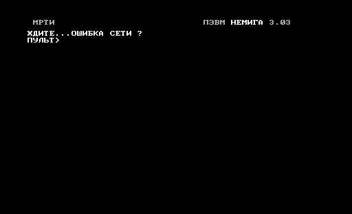
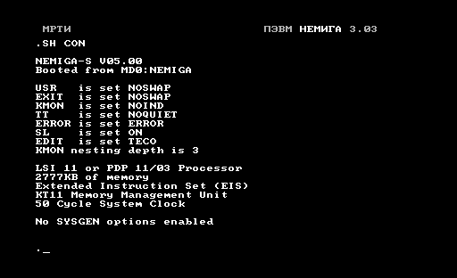
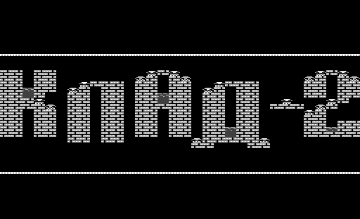
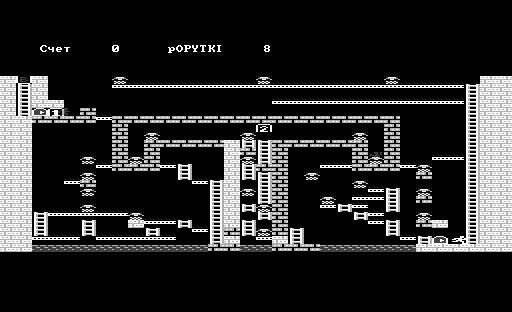
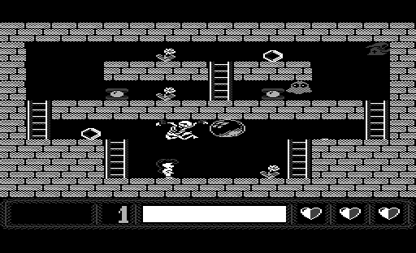

# nemigabtl-testbench
NemigaBTL emulator test bench -- Win32 console application used to run regression tests

#### Screenshots
System monitor prompt:

RT-11 configuration:

Game KLAD2:

Game HORROR:

##### See Also

* [**nemigabtl**](https://github.com/nzeemin/nemigabtl) -- NemigaBTL emulator.
